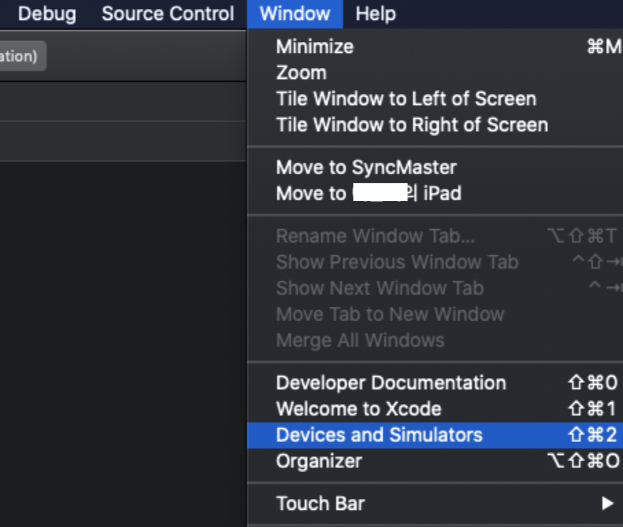
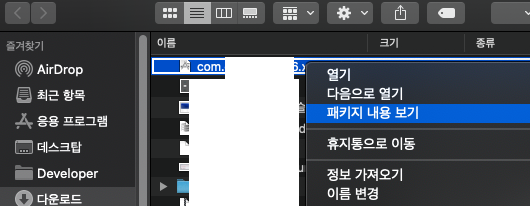
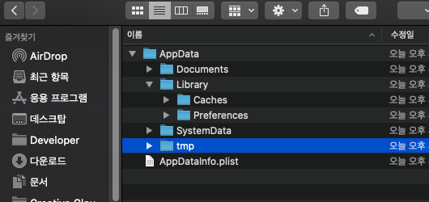

> Xcode version 12   
(대부분의 하위 버전에서 비슷하게 동작)

iOS는 보안 문제로 안드로이드처럼 IDE에서 디바이스의 모든 공간에 접근할 수는 없는 모양이다.
하지만 앱의 내부 저장소에는 접근할 수 있다.   
   
   
# 1. Devices and Simulators
* * *
Xcode 상단 메뉴에서 **Window - Devices and Simulators** 를 누르면 USB로 연결된 디바이스 목록이 나온다.   
   

   
# 2. 컨테이너를 다운받아 파인더에서 AppData 확인
* * *
내부 저장소를 가져오고 싶은 앱을 선택한 후 아래쪽 **톱니바퀴 버튼**을 눌러 컨테이너를 다운받는다.   
   

   
다운받은 컨테이너는 바로 볼 수 없고 **우클릭 - 패키지 내용 보기**를 통해 파인더에서 확인할 수 있다.  
   

   
아래는 패키지를 열었을 때 나오는 기본적인 앱 데이터 구조이다.   
   

     
* * *   
   
로컬에 로그 등을 남겨두는 경우가 있는데 확인하려고 아이튠즈를 깔다가(...) 찾아보니 이렇게 확인할 수 있었다. 안드로이드 스튜디오에 비하면 참으로 번거롭다.   
Xcode를 자주 만지지 않기 때문에 까먹지 말자고 기록해 둔다. 
