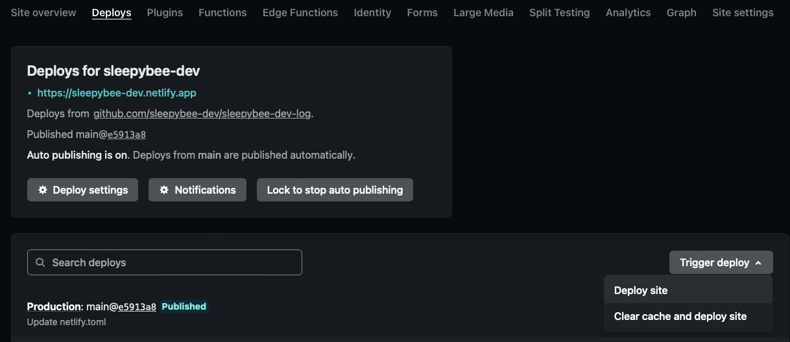
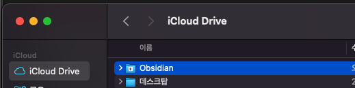
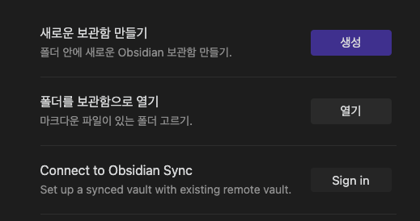
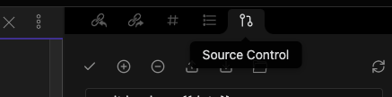

---
tags:
  - Obsidian
  - Blog
title: 옵시디언 블로그 만들기
date: 2022-08-07
---

이 글을 따라오면 메모-포스팅-발행까지 옵시디언 원툴로 가능해집니다.
심지어 무료.(22년 8월 현재)

Github 블로그를 만들어 본 적이 있다면 Github 블로그를 obsidian 구조로 제작한다고 생각하면 편합니다.

본 가이드에서는 내가 쓰고 있는 [obsidian-zola](https://github.com/ppeetteerrs/obsidian-zola) 탬플릿을 사용할 것입니다. 몇 가지 검토해봤는데 옵시디언 데스크탑 앱이나 공식 퍼플리싱과 레이아웃이 비슷하고 Github에 있는 소스도 이해하기 편해서 선택했습니다.

> 다른 SGG도 사용가능하지만 obsidian의 데이터 구조를 그대로 활용할 수 있게끔 나온 탬플릿인 것이 좋습니다. 또한 마크다운 기본 문법이 아닌 **아웃링크 \[\[\]\]가 링크화되게끔 처리되어 있어야** 옵시디언을 백분 활용할 수 있습니다.

> **netlify**는 SGG별로 build option을 다르게 주면 통합 처리된다고 하니 다른 SGG를 사용한다면 [여기](https://docs.netlify.com/integrations/frameworks/?_ga=2.155139773.421626894.1662357885-538442470.1660614030) 참고.

## 0. 결과물 데모

🔗 https://peteryuen.netlify.app
        
물론 나의 이 블로그도 결과물이다. (그런데, 탬플릿 수정이 약간 있는)  
나의 탬플릿을 활용하고 싶다면 [여기](https://github.com/sleepybee-dev/obsidian-zola-bee)에서 fork 후 READ.ME를 읽고 개인화할 필요가 있다.

>**Warning**
>\[2024.07.17. 수정\] 현재 제 블로그는 Hoodie님의 테마가 마음에 들어 Zola가 아닌 Gatsby로 넘어왔습니다.
  

## 1. 준비물

Git과 Github에 대한 지식이 필요합니다.
Git과 Github이 뭔지 어떻게 쓰는지에 대한 얘기는 다루지 않습니다.

## 2. Github Repository 생성

경험상 블로그로 활용할 vault에 Git을 붙이는 것보다 레파지토리를 Checkout에서 vault로 삼는 게 이해하기 편합니다.
전 [sleepybee-dev-log](https://github.com/sleepybee-dev/sleepybee-dev-log)라는 이름으로 레파지토리를 생성했습니다.
아직 Checkout 하지 않습니다.

## 3. Repository에 netlify.toml 파일 만들기

`netlify.toml`는 메타 파일이지만 사실 진입 페이지 UI파일이나 다름없기 때문에 vault에 넣어서 같이 관리해줄 필요가 있는 파일입니다. 그래서 Checkout 전에 만들어 줍니다.

(1) 레파지토리에서 `Add File` - `Create New File` - 파일명 `netlify.toml`

(2) obsidian-zola에서 [sample파일](https://github.com/ppeetteerrs/obsidian-zola/blob/main/netlify.example.toml) 내용 복붙

(3) 내 사이트에 맞게 값 수정

    - (필수) **REPO_URL = 내 레파지토리 url**

    - TIMEZONE = "Asia/Seoul"

    - 그밖에 원하는 값 자유롭게 변경

## 4. netlify Site 생성

netlify는 무료 퍼플리싱 플랫폼입니다.
github 레파지토리를 연동해서 배포해주는 시스템이 잘 돼있습니다.
무엇보다 무료.

(1) [netlify](https://www.netlify.com) 가입 & 로그인

(2) `Add new site` - `Import an existing project` - `Github` 클릭 후 내 레파지토리 선택

### 4-1. 최초 배포 (netlify deploy)

이 순서대로 했다면 필요없지만 혹시 다른 순서로 작업했다면 최초 배포를 수동으로 해야하는 경우가 있습니다.

netlify.toml이 작성된 후 netlify에서 이 메타 파일을 한 번은 읽어주기 위함입니다.

netlify에서 만든 site를 누르면 탭 중에 `Deploys`가 있을 것입니다.

우측 중단에 `Trigger deploy - Deploy site`

## 5. Repository Checkout

이제 Checkout합시다.

주의할 점은 다른 PC, 모바일과 동기화를 하려면 iCloud, OneDrive, 구글 드라이브 등 내장되어있는 클라우드 위치에 넣어야 한다는 것입니다. obsidian에서 공식 지원하는 건 iCloud 뿐이나 로컬 파일로 관리되므로 어떤 클라우드를 사용해도 무방합니다.(몇 가지 이슈가 있기는 한 모양)

제 경우 iCloud를 씁니다.

옵시디언을 설치하면 기본적으로 있는 Obsidian 폴더 안에 레파지토리를 Checkout했습니다.
  

## 6. Obsidian vault로 열기

`'폴더를 보관함으로 열기'`를 눌러 방금 checkout한 폴더(sleepybee-dev-log)를 선택합니다.

  
## 7. 글 쓰고 Push

자, 이제 자유롭게 써봅시다.

**당신이 만든 폴더 구조가 곧 블로그의 메뉴 구조가 될 것입니다.**

이미지를 붙여넣으면 `content` 폴더가 생성 될텐데 [obsidian-zola](https://github.com/ppeetteerrs/obsidian-zola)에서 `content`폴더는 자동으로 invisible해주니 블로그 메뉴엔 보이지 않습니다.

글 쓴 후 Git push만 하면 netlify가 레파지토리를 보고 있다가 push에 맞춰 자동으로 사이트를 배포해줍니다. (반영까지 10초 정도 소요되는 것 같습니다.)
  

## 8. Obsidian-git 플러그인 사용하기 (Optional)

git command 가 능수능란하다면 필요없겠지만 전 obsidian에서 모든 걸 해결하고 싶기 때문에 git 플러그인도 설치했습니다.

- obsidian 설정 - 서드파티 플러그인 - 커뮤니티 플러그인 - Obsidian Git 설치 후 Enable

우측에 Source Control이라는 탭이 생겼을 겁니다.

`Source Control` 탭에서 `Changes`를 `+`로 스테이지에 올리고 `v` 버튼으로 커밋, 4번째 버튼으로 푸시.

첨부한 이미지 파일 등도 누락되지 않게 Commit, Push 해주어야 합니다.

  

## 9. 개인 메모는 어떻게?

두 가지 방법이 있고 전 둘 다 쓰고 있습니다.

1. git에 올리지만 않으면 블로그에 올라가지 않기 때문에 git ignore를 이용한다.

2. 개인 노트용 vault를 따로 둔다.

  

블로그용으로 수집된 개발 지식 관련 메모들은 1번을 이용하고 정말 개인적인 건 2번을 쓰고 있습니다.

## 개인 메모와 블로깅을 옵시디언 하나만 켜서 끝낸다.

옵시디언의 노트 기능이 나이스한 건 말할 것도 없고 위 작업으로 인해 블로그 역시,

1. 글 쓰기

2. Source Control 에서 Commit & Push

딱 이 동작만으로 발행합니다.
폴더 구조를 바꾼다고 블로그의 메뉴 구성을 따로 손 볼 필요도 없습니다.

**이 모든 것이 무료이며, 탁월하다.**

노션으로 원툴 블로그하겠다고 애쓰던 나에게 RIP.
여러분도 옵시디언하시고 새 삶을 찾기를 바랍니다.