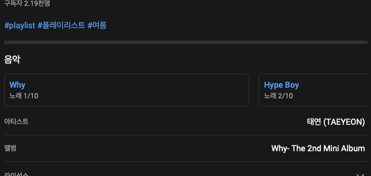
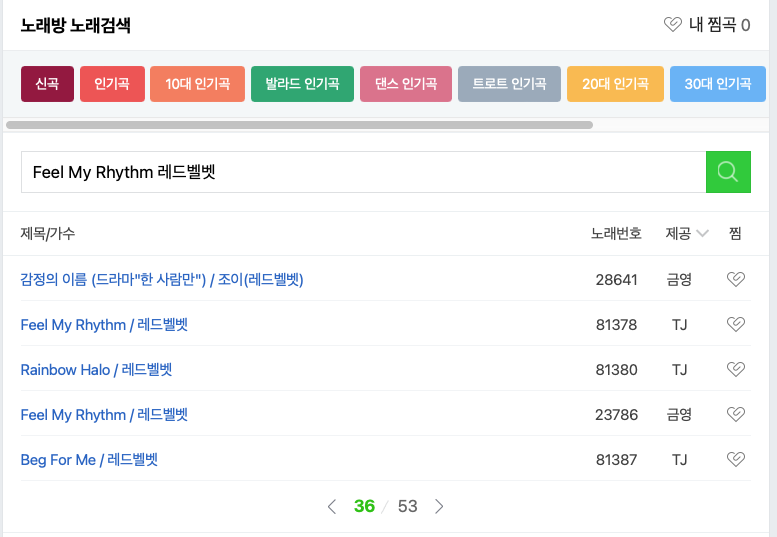

[$card](https://play.google.com/store/apps/details?id=com.sleepybee.singpli)

## Concept

-   **플리불러**는 유튜브 플레이리스트(이하 플리)에 있는 노래들을 노래방 번호로 뽑아냅니다.

-  검색한 플리를 노래방 정보와 함께 보관할 수 있습니다.

-   [TODO]  유저들의 인기 검색 플리 등을 수집하여 노래방 기기와는 별도의 인기순위를 제공합니다.      

  

## why

- 어느날 일하면서 듣는 플리에 흥이 차서 퇴근길에 노래방에 갔습니다. 듣고 있던 플리에 나오는 곡들을 하나하나 검색하면서 노래하는 게 참 번거로웠습니다.

-   특히 J-POP을 자주 들어서, 플리에 있는 일본곡들을 일일이 복붙해서 검색해봐야 했습니다.

-   애초에 노래방 소프트웨어에서 비슷한 곡을 추천한다거나 일어입력기가 있었다면 좋았겠지만, 30년째 발전하지 않는 노래방 기기.

-   ~~오타쿠는 더이상 참을 수 없었다.~~

  

## Simple Scenario
-   검색 페이지에서 유튜브 플리 검색 > 플리의 음악 수집 > 노래방 정보로 추출하여 리스팅  

  

## How To
-   유튜브 플리에는 사용된 음악 메타를 표출하는 컴포넌트가 있습니다.

- 여기서 내용을 긁어 추출한 음악들을 네이버 노래방 검색으로 번호를 찾게 하였습니다.

-   (태진이나 금영의 공식 홈페이지 검색을 사용할 수도 있었으나 공홈의 상태가 매우 나빴습니다. 공식적으로 API를 받을 수 없을까 메일 문의를 했는데 제공할 수 없다는 답변을 받았습니다.)  
  

## Remarkable

-   상술했듯이 오타쿠라 일본곡 검색에 신경을 썼습니다.

-   유튜브의 음악 제목과 노래방의 음악 제목은 간극이 있습니다. 영문으로만 표기하는 경우가 많습니다.

> [예시]
> - 유튜브 :  ZUTOMAYO - Byoushinwo Kamu
> - 노래방 : 宿題を噛む / ずっと真夜中でいいのに。

  
- 네이버 노래방 검색은 대히트곡인 `Kenshi Yonezu - Lemon` 조차 이해하지 못해서  팝가수인줄 알고 `lemon tree`(!)를 내뿜었습니다.

-   이런 식의 일본곡들은 웹에서 한자를 긁어와서 재검색하고 `米津 玄師 - Lemon`이 나오게끔 처리했습니다.

-   코드 상에서 국적 등이 구분이 어려운 친구들은 검색어 치환 키트를 서버에 저장해서 치환해주고 있습니다.

  

>  BOL4 -> 볼빨간사춘기

  

## Limitation

-   플레이리스트에 50곡이 있든 100곡이 있든 딱 <u>**상위 10개곡**</u>만 추출할 수 있습니다. 이는 유튜브가 메타를 상위 10곡만 제공하기 때문인데요. 이 메타도 최근에 생긴 거라 추후 전곡 노출로 변경될 수도 있습니다.

-   반대로 유튜브가 메타를 제공하지 않게 되면 앱이 기능하지 않게 됩니다. *유튜브의 음악 메타 노출 정책에 100% 기대고 있습니다.*

-  노래방 검색 성능이 안  좋아서 못 찾는 경우도 있습니다. 치환 키트로 방법을 모색했으나 실패했습니다.

> `레드 벨벳 - Feel my rhythm`은 노래방 DB 그대로 써서 검색해도 번호가 36페이지에 나오는데 36페이지까지 뒤지는 방법이 있긴 하지만 성능을 위해 그냥 포기.
> 

## Dev Story 

-   `Kotlin`, `AAC`, `MVVM`, `JSoup`, `Firebase`, `Retrofit`, `Youtube data v3`

- 최초 소스만 공개합니다. (유지보수 하다가 API key 등이 실수로 노출될까봐)

- Github : https://github.com/sleepybee-dev/SingPli

- 무식하게 긁어와서 구조가 한눈에 보이기 때문에 유튜브 음악 메타를 쓰려는 사람은 매우 참고가 될 것입니다.

-   `JSoup`은 랜더링되기 전 소스코드를 긁어오는데 이때 유튜브 음악 메타가 엄청나게 긴 json값에 있어서 정규식으로 뽑아냈습니다. 네이버 검색은 DOM을 그대로 쓸 수 있었습니다.

## Release

 최초 배포 - 2022.08.11