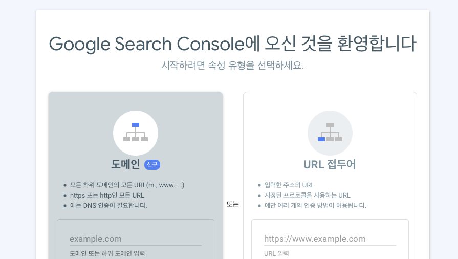
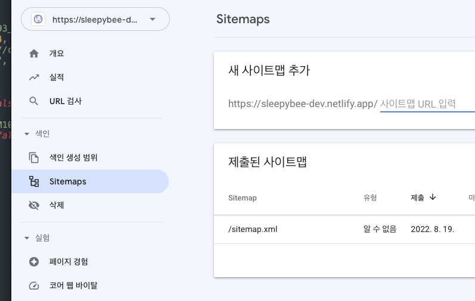
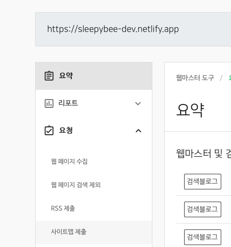
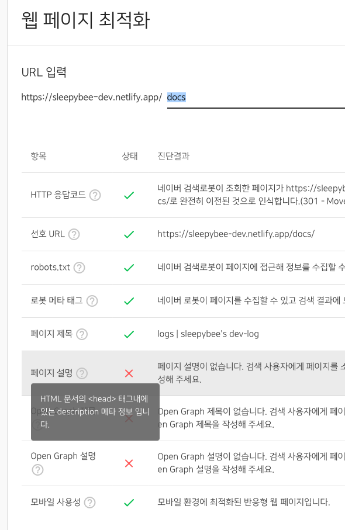

## Zola 공통 사항

- 소유권 확인을 위해 DNS 인증이 아닌 html meta tag 인증을 사용. (구매한 도메인이 있다면 DNS 인증도 가능)
- html meta tag는 `/zola/template/base.html`의 header에 추가.
- Zola를 비롯한 대부분의 SSG(Static Site Generator)들은 검색 엔진 콘솔에 제출할 수 있는 형식으로 사이트맵을 짜준다. 도메인 뒤에 `/sitemap.xml`만 입력.
- 탬플릿 수정 후엔 반드시 netlify에서 deploy.
  

## 구글 검색

- 구글 서치 콘솔 Google Search Console
	- https://search.google.com/search-console

- URL 접두어로 인증

- 사이트맵 추가

  
## 네이버 검색

- 구글 서치 콘솔과 크게 다르지 않습니다.

- 네이버 서치 어드바이저
	https://searchadvisor.naver.com/console/board

- 사이트 등록 및 메타 태그 인증

- 사이트맵 추가

 

  

- 웹페이지 최적화

- 최적화에서 옵시디언 노트들이 들어 있는 docs를 돌려보고, 없는 태그를 `/zola/template/base.html`에 추가합니다.

  
---

반영하는 데에 며칠이 걸리는 모양.
현재 블로그 내용 어떤 걸 어떤 식으로 검색해도 어디에도 노출되지 않는데 경과를 지켜보도록 하겠습니다. 

+
일반 키워드로는 내 블로그까지 노출되지 않지만 포스트 타이틀로 검색하니 구글, 네이버에서 검색이 되었습니다. (원래는 타이틀 그대로 검색해도 노출이 안됐음) 
