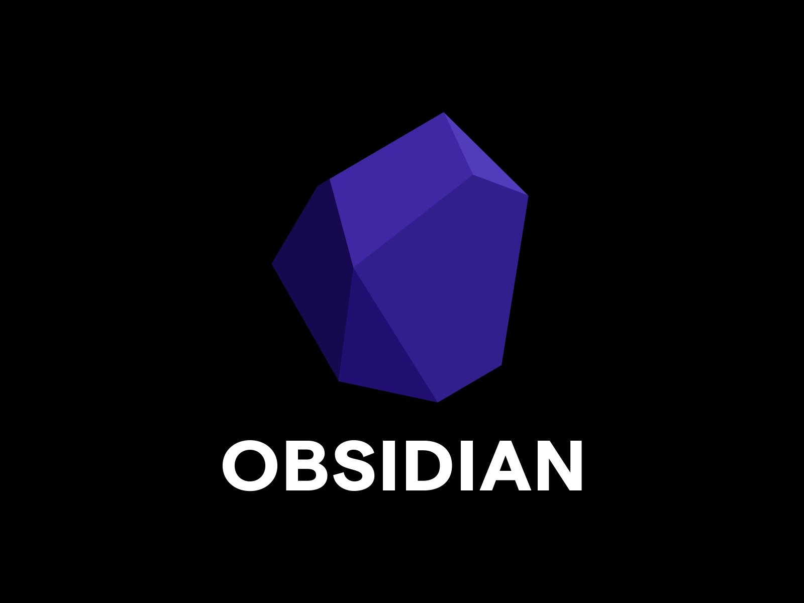

---
tags:
  - Obsidian
title: (슬라이드) Shallow Dive to Obsidian
date: 2022-10-14
---
>해당 포스트는 모각코 모임 발표 때 만들었던 마크다운 슬라이드를 아카이브한 것입니다.

제1회 재개발코딩 모각코 공부자랑

## Shallow Dive To  OBSIDIAN

https://obsidian.md

  

---

## 1. 노트툴에 대한 고민

1. 에버노트

    - 잔버그 때문에 잦은 업데이트

    - 연동 기기 수 2개로 제한 (무료버전)

    - 쉼없는 구독 권유

    - 마크다운을 쓰려면 별도의 플러그인 필요

2. 노션

    - 불편한 블록

    - 잡다한 기능 때문에 모바일에서 매우 불편

    - 불완전한 마크다운
  
---

## 😘 옵시디언하자!

- 무료

- 데스크탑 클라이언트, 모바일 앱 모두 지원

- 파일 로컬관리로 클라우드를 통한 무제한 싱크 가능 (공식 지원: iCloud, OneDrive)

- 마크다운 완벽 지원

- 태그, 아웃링크, 백링크

- 강력한 플러그인들, 툴이 오픈소스라 계속 개발되는 중.

  

---

## 2. 블로그에 대한 고민

- 디자인 자유도가 너무 높은 Github 블로그, 자유도가 너무 낮은 velog.

- Github 블로그, 티스토리, velog 등은 노트툴과 별개의 툴로 운영해야 함.

- 노션은 노트와 블로그를 함께 할 수 있으나 퍼블리싱해주는 oopy가 유료다.(월 3900원) 또한 목록을 페이지 안에서 새로 짜야 한다.

  

---

## 😘 옵시디언으로 블로그하자!

- Github 블로그처럼 SGG를 붙여 퍼블리싱하므로 자유도가 있는 탬플릿으로 구현 가능하다.

- 툴에서 쓴 폴더 구조 그대로 블로그를 만들 수 있다. 따로 목록 UI를 구성할 필요가 없다.

- 높은 자유도와 정적인 레이아웃의 적절한 조화 가능

- 개인 노트도 그 툴에서 그대로 하면 된다.(git ignore를 쓰거나 별도의 vault 추가)

- 무료 퍼블리싱 : netlify, Git Pages

---

## 3. 툴 톺아보기

- 깔끔한 에디터 UI

- 실시간 마크다운 프리뷰 지원

- mermaid Embeded

- 커뮤니티 플러그인

    - Cmenu, Advanced Slide, Obsidian Git

- **(!) 개발자 친화적인 데이터 관리**

    - front matter, data view(플러그인)

  

---

## 4. 그래도 단점은 있다 -1

- 공유가 어려움

    - 페이지 공유 : 퀵 퍼블리시 플러그인

    - 페이지 공동 편집 : 불가

- 자유 정렬 지원하지 않음.

    - 오로지 가나다순 알파벳순으로 sorting.

    - 이용자들은 앞에 숫자를 붙여 원하는 대로 정리해야 함.

  

---

## 4. 그래도 단점은 있다 -2

- 유료 플랜 비싸게 나옴.

    - Sync : 월 10달러 <-> 에버노트 월 6천원

    - Publish : 월 20달러 <-> oopy 월 3900원

        - 옵시디언 공식 퍼블리싱 예 : [당근마켓 지식 저장소](https://publish.obsidian.md/karrot/README)

- 개발자 친화적이라 진입장벽 높음  

...  

### 대부분 크리티컬하지 않아! 😤

---

## 5. 더 잘 쓰려면

- 제텔카스텐, 디지털가드닝 기법을 활용한 노트테이킹

- 커뮤니티 더욱 활성화 필요  

  

---

  

> 제 삶은 옵시디언을 쓰기 전과 후로 나뉠 것 같습니다. - 의정부 사는 이 모 씨

  

