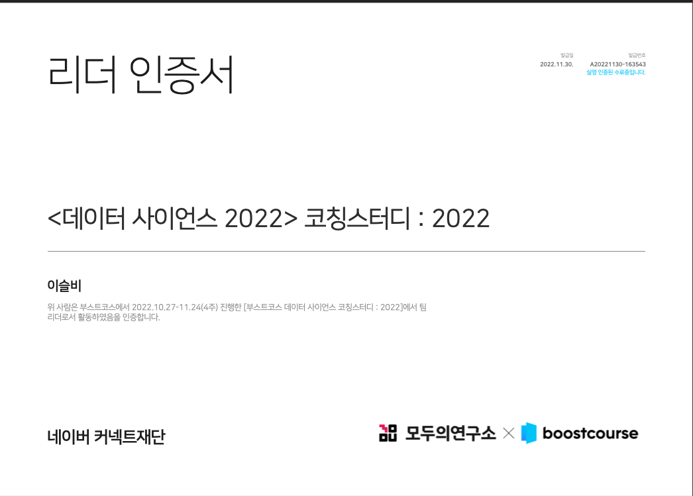

### 기간

2022.10.27 ~ 2022.11.24 (4주)

  

## 부스트코스란

네이버 커넥트 재단에서 지원하는 무료 코칭 스터디다.

인강은 끈기있게 안 듣게 되는데 여기는 강사와 별개로 조별 코치가 있다. 실시간으로 질문을 받아주고 과제를 검토해서 피드백을 준다.

  

## 갑자기 웬 데이터사이언스?

방탈출 앱을 만들다보면 가공하고 싶은 데이터들이 많다. 평균 탈출시간, 인원, 지역 분포도 등등.. 그러다보니 기초적인 건 알아두면 좋겠다고 생각해서 강의도 사둔게 있다. 근데 안 듣는다. 아무래도 안드로이드 개발 강의가 우선이다보니 밀렸다. 그런데 코치도 있고 여럿이서 조를 짜서 하는 스터디성 강의에다가 무료이기 까지 하니 무조건 수료하게 되겠다 싶어 지원해버렸다.

  

## 리드부스터

참가자를 부스터라고 부르는데 리드부스터로 지원했다. 역시나 나에게 끈기를 강제로 심어주기 위해서 리드부스터로 지원했다. 하는 일은 거의 팀 과제를 모아서 제출하는 거 밖엔 없었다.

  

## 배운 점

사실 데이터사이언스에 대한 이론적인 걸 더 배우고 싶었는데 사실상 파이썬과 판다스로 데이터 시각화하는 연습을 하는 코스였다. 대부분 원할 때 구글링해서 익힐 수 있는 수준이었다. 그래도 안해봤으니, 그냥 해봤다, 라는 것에 만족한다. 그리고 같은 시각화 과제라도 팀마다 다른 식으로 짜서 제출하던데 그런 다각적인 접근을 볼 수 있었던 건 흥미로웠다.

과제들은 구글 코랩으로 만들었는데 과제에 대한 저작권이 있어 블로그에 공개하면 안된다고 한다.

  
