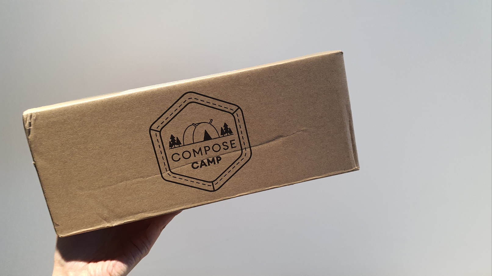
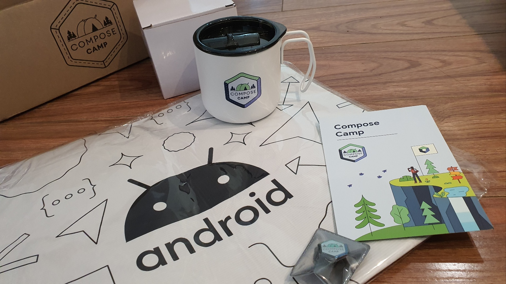
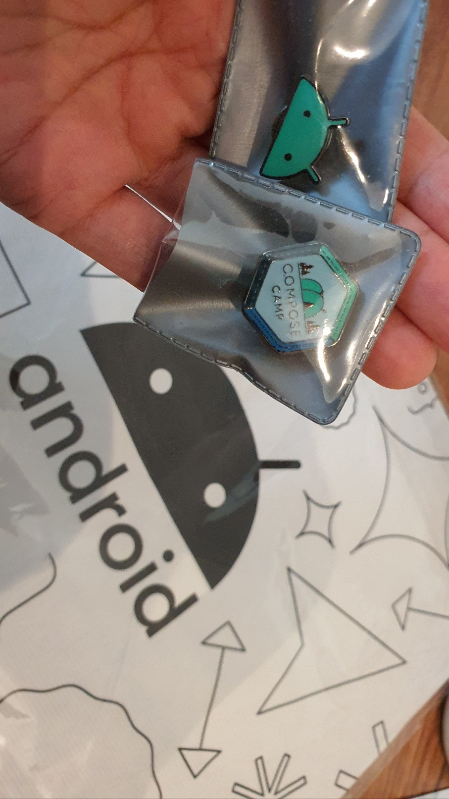

## 기간

2022.11.07 ~ 2022.12.16

## 참여 계기

컴포즈가 핫해서? 새로운 게 공부하고 싶어서?
물론 그런 것도 있지만 난 공부는 굳이 코드랩으로 하지 않는다.
그럼에도 컴포즈 캠프에 참여한 건,

굿즈를 가지기 위해서다!!
나와 같은 사람들 꽤나 많을 것이다.

  

## 처음 접한 Compose

Flutter를 자주 쓰다보니 낯설지 않은 선언형 UI.

modifier의 순서가 중요한 부분이 상당히 낯설고 이상했지만 전체적으로 이해하기 어렵지 않았다.

하지만 실무에서 Compose를 도입하려고 할 때 어차피 선언형 UI에 대한 러닝코스트를 가질 거라면 Flutter를 쓰는 게 비용적으로 좋지 않을까 싶다. 체감하기엔 상태관리 측면에서 Flutter보다 까다롭다.

공식 문서 : <Compose를 사용해야 하는 이유>  

[$card](https://developer.android.com/jetpack/compose/why-adopt?hl=ko)
       
## Github

Compose Camp 진행한 내 깃헙 (folk 떠서 PR로 제출했다)

https://github.com/sleepybee-dev/ComposeCamp2022
  
  

## 수료 굿즈

이제 본론으로 들어가서(?) 굿즈 공개.

구성은, 나이키 리유저블 백 재질의 비닐스런 숄더백, 캠핑 컵, 뱃지 두 가지.

다 너무 맘에 든다.

  

  

저 가방을 들고 어딜 갈 수 있는가는 이제부터 고민해 봐야 한다. ㅋㅋㅋ